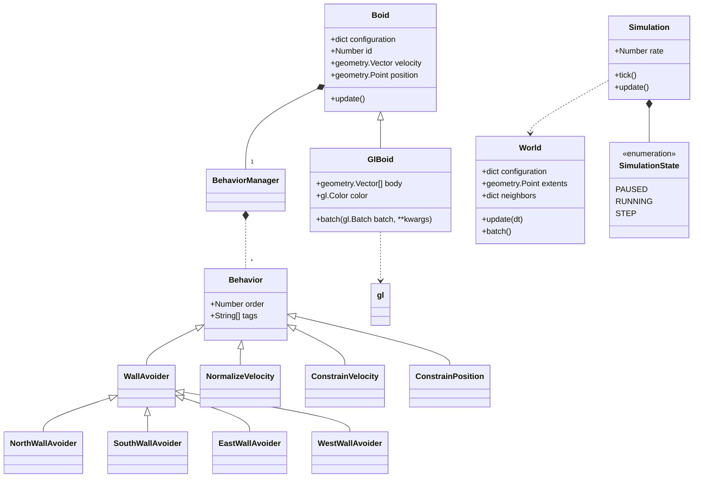
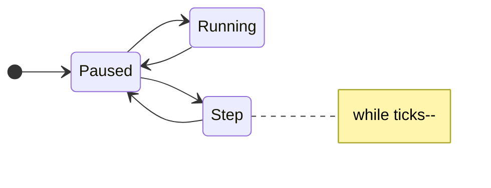

# Boids

Back-end Python service which implements the Boid behavior.

## Development Environment

### Prerequisites:

* Generate code from the `boids-api` project
* Create Kafka topics
  ```
  user@host:~ PYTHONPATH=/workspace/src /workspace/kafka-util.py -c conf.d/boid-kafka.yaml init
  2023-05-11 19:10:06 - INFO   -          AdminClient - Created topic boids.boids
  2023-05-11 19:10:06 - INFO   -          AdminClient - Created topic boids.system-events
  ```

### Running inside the container
```
user@host:~ PYTHONPATH=/workspace/src /workspace/BoidsSimulation.py --port 9090
2023-05-11 19:10:50 - INFO   -    SimulationManager - State == PAUSED
...
2023-05-11 19:10:50 - INFO   -      BoidsSimulation - Starting HTTP Server listening at :9090
...
```
### Running Unit Tests
```
$ cd /opt/boids-gateway
$ PYTHONPATH=src:${PYTHONPATH} pytest test
```

### Querying topics
```
user@host:~ PYTHONPATH=/workspace/src /workspace/kafka-util.py -c conf.d/boid-kafka.yaml topic list
Topic name                     | Partitions
-------------------------------+-----------
boids.boids                    |          1
boids.system-events            |          1
...

user@host:~ PYTHONPATH=/workspace/src /workspace/kafka-util.py -c conf.d/boid-kafka.yaml topic query boids.boids
boids.boids: 6 msgs
Earliest message time: 2023-05-11 19:11:07
Latest message time:   2023-05-11 19:11:08
```

Boids program optmised using tiling and DBSCAN clustering

Requires: Pyglet, Numpy, sklearn.cluster

Run BoidsSimulation.py

Read more here: https://adamprice.io/blog/boids.html




